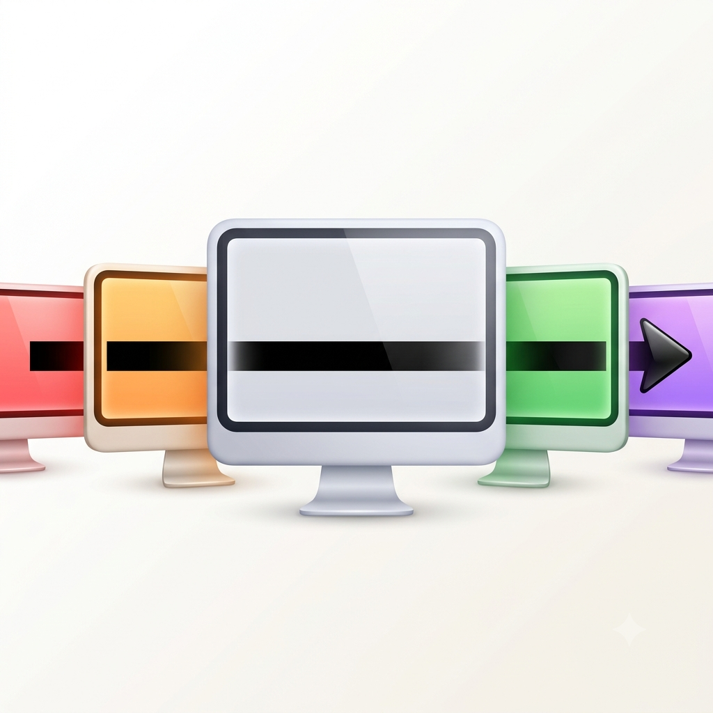
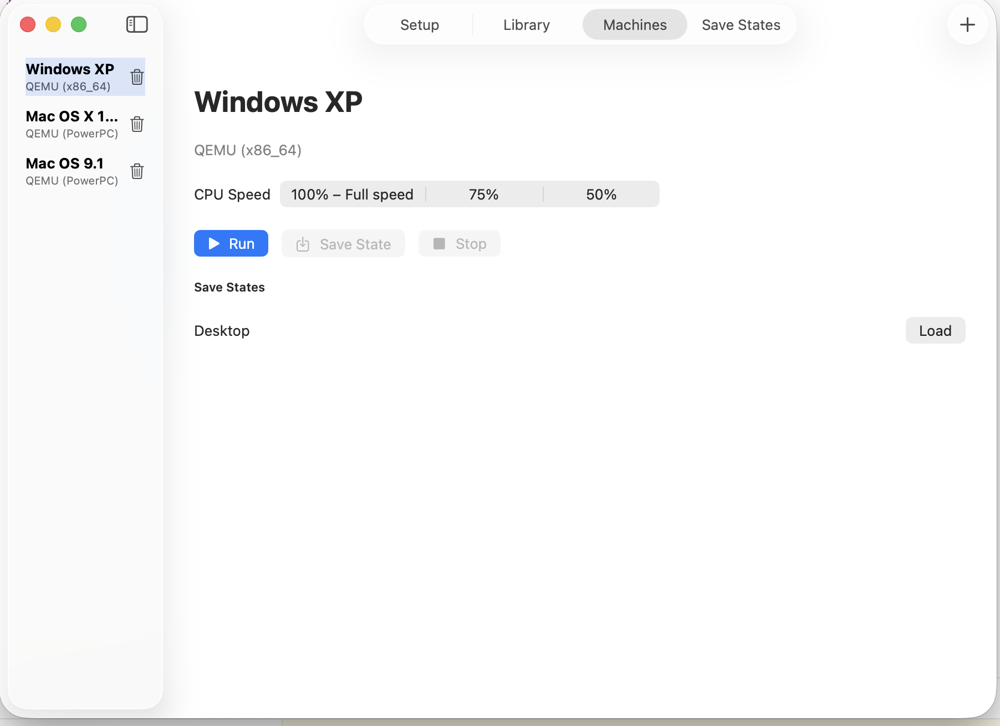
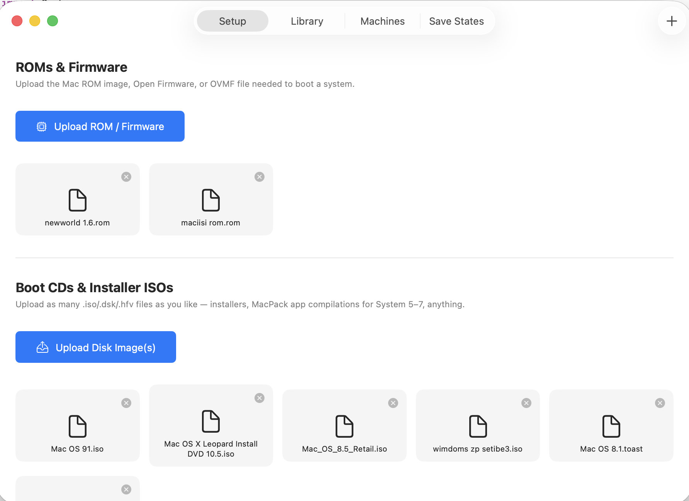

# Retro MultiOSE

<p align="center">
  
</p>

<p align="center">
  <strong>A native macOS front-end for running vintage Mac OS, Mac OS X, and Windows XP side by side.</strong><br/>
  Built on QEMU, Basilisk II, and SheepShaver — one clean SwiftUI app, four emulation backends, real save states, and full machine editing.
</p>

<p align="center">
  <strong>Version 0.2.0</strong> — see <a href="#whats-new-in-v020">what's new</a> and <a href="#known-issues">Known Issues</a> below.
</p>

---

## What is this?

Retro MultiOSE is a SwiftUI macOS app that orchestrates classic emulators — QEMU, Basilisk II, and SheepShaver — behind one polished interface. Instead of juggling separate apps, command-line flags, and hand-edited config files for each system you want to run, you get:

- A **Setup** tab to import ROMs, boot CDs/installers, and hard disks
- A **Machines** tab to configure, launch, and now fully **edit** virtual machines per OS
- Real, working **Save States** on QEMU-based machines — name them, load them, resume instantly
- Adjustable CPU speed presets per backend
- A RAM field spanning **128 KB to 8 GB** — real Mac 128K territory all the way up to modern excess
- **Multi-disk support** — attach a boot CD *and* multiple hard disks (an OS disk plus a software collection like MacPack, for example) to the same machine

## What's new in v0.2.0

This release adds a genuinely major feature and squashes several real stability bugs found during extended testing:

- **Edit Machine** — change a machine's ROM, boot CD, hard disks, or RAM *without* deleting and recreating it. Eject a boot CD once install is done so the machine boots straight to the desktop instead of the installer every time. Attach additional disks (create a new blank one at any size, upload a file, or reuse one from your library) alongside an existing OS disk.
- **Multi-disk attachment** — both at machine creation and via Edit, you can now select or attach more than one hard disk at once.
- **Custom RAM range** — replaced the old 64 MB–floor stepper with a free-text field plus a KB/MB/GB unit picker, spanning the app's full supported range.
- **Basilisk II stability fix** — a real, documented `modelid` mismatch was causing Basilisk II to hang a few seconds into every boot on Apple Silicon. Fixed via a corrected default value, with `modelid` now configurable per machine.
- **Mac OS 9.x support confirmed** — QEMU's PowerPC backend can boot classic Mac OS 9.x directly through Open Firmware, with **no ROM file required at all**. This is now the recommended path for classic Mac OS 9 specifically.
- **Save States correctly scoped** — the Save State button now only appears for QEMU-based machines (Basilisk II and SheepShaver have no equivalent snapshot mechanism), instead of showing a confusing error.
- **Persistence hardened** — machine configurations now use a defensive decoder that gracefully handles future schema changes, instead of silently discarding all saved machines if the app's data model ever changes.
- **Archive/distribution fix** — resolved a code-signing failure that could occur when building a distributable version of the app.

## Screenshots

<p align="center">
  <br/>
  <em>Windows XP, Mac OS X 10.5 Leopard, and Mac OS 9.1 — all running at once, side by side.</em>
</p>

<p align="center">
  
  
</p>

## Supported systems

| System | Backend | Status |
|---|---|---|
| Windows XP | QEMU (x86_64) | ✅ Fully working — installs, boots, snapshots |
| Mac OS X 10.5 (Leopard confirmed) | QEMU (PowerPC) | ✅ Fully working — installed and booted to desktop |
| Mac OS 9.x | QEMU (PowerPC) | ✅ Fully working — **no ROM required**, boots directly via Open Firmware |
| System 6 / 7.x (68k) | Basilisk II | ✅ Working — boots and runs correctly with a valid period ROM |
| Mac OS 8.5–9.0.4 | SheepShaver | 🟡 ROM-dependent, see Known Issues |

## Known Issues

Being upfront about what still needs work:

**SheepShaver (Mac OS 8.5–9.0.4)**
SheepShaver requires a real Old World or New World Power Mac ROM, and has two hard constraints worth knowing before you try:
- **Blue & White G3 ROMs are not supported by SheepShaver at all** — this is a documented upstream limitation, not a config issue. A Beige G3, or ROMs from the Power Mac 6100/7200/7500/8500/9500 family, are known to work.
- SheepShaver's real supported ceiling is **Mac OS 9.0.4** — later 9.1–9.2.2 aren't supported since SheepShaver doesn't emulate an MMU.
- **If you just want classic Mac OS 9.x working, skip SheepShaver entirely — use QEMU (PowerPC) instead.** It boots OS 9.0–9.2.2 directly via Open Firmware, no ROM dump needed at all, and is fully working in this build.

**Basilisk II modelid tuning**
The default `modelid` value (14) resolves the Apple Silicon boot-hang issue for Mac II-series/Quadra-class ROMs, but hasn't been exhaustively verified as optimal for every possible 68k Mac ROM. If Basilisk II hangs on boot with a different ROM than what's been tested, try adjusting `modelid` for that machine.

**Multi-disk machines still have some manual steps**
While you can now attach multiple disks to a machine, make sure a disk intended to be writable is attached under **Hard Disks**, not **Boot CD/Installer** — the two slots behave very differently (CD-ROM media is always read-only, matching real hardware behavior).

**Quitting the app kills running VMs**
QEMU/Basilisk/SheepShaver run as child processes of the app. Quitting Retro MultiOSE (or a crash) terminates any running machines — there's no "detach and keep running in background" yet.

## Installation

1. Download the latest `.dmg` from [Releases](../../releases)
2. Open it, drag **Retro MultiOSE.app** to Applications
3. First launch: right-click the app → **Open** (it's unsigned/ad-hoc — see [Licensing](#licensing) for why)
4. Go to **Setup** and import your own ROM/firmware files and disk images — see [Getting media](#getting-media) below

## Getting media

**This app does not include or link to any copyrighted Apple or Microsoft software.** You need to supply your own:

- **ROM/firmware files** — dumped from real vintage Mac hardware you own, using tools like BlueSCSI-based dumpers or utilities from the 68kmla.org community
- **OS installer/boot disk images** — imaged from discs you own via **Disk Utility → File → New Image → Image from [disc] → DVD/CD master format**. This specific format matters — a plain/generic rip often strips the Apple Partition Map and HFS boot structure needed to actually boot.
- You may find software and ROMs available for download elsewhere online, but be aware that downloading copies you don't have rights to is software piracy and illegal, even for old or commercially unsupported operating systems. Use only ROMs you've dumped yourself and media from discs you legitimately own.

## Building from source

### 1. Compile the backends

```bash
./Scripts/build_qemu.sh
```

This builds `qemu-system-ppc`, `qemu-system-x86_64`, and `qemu-img` with HVF-ready flags. It'll ask for Homebrew dependencies along the way.

Basilisk II and SheepShaver are built separately from the same source tree:

```bash
git clone https://github.com/kanjitalk755/macemu.git /tmp/macemu
cd /tmp/macemu/BasiliskII/src/Unix && ./autogen.sh && ./configure && make
cd /tmp/macemu/SheepShaver/src/Unix && ./autogen.sh && ./configure && make
```

> **Note on Apple Silicon + newer Xcode toolchains:** you will likely hit `-std=gnu23` incompatibility errors in Basilisk II/SheepShaver's Makefiles (they predate modern C/C++ standard defaults). Fix by patching the Makefile's `CC`/`CPP` variables to force `gnu99`/`gnu++17` as needed.

### 2. Bundle the binaries

Copy all five binaries (`qemu-system-ppc`, `qemu-system-x86_64`, `qemu-img`, `BasiliskII`, `SheepShaver`) plus QEMU's `share/` firmware folder into:

```
RetroMultiOSE/Resources/qemu/
```

### 3. Add to Xcode

- Add the `qemu` folder via **File → Add Files** → **"Create folder references"** (blue folder icon)
- If `qemu-img` specifically doesn't show up in the built app's `Contents/Resources/` after a Clean Build Folder + rebuild, add it a second time as a **standalone individual file reference** — folder references don't always reliably pick up files added after the initial "Add Files" step.
- Check **Build Phases → Compile Sources** for any stray firmware files that got miscategorized as source code — remove them from that list if present.
- Under **Build Phases**, add a Run Script phase (after "Copy Bundle Resources," marked **"For install builds only"**) containing:
  ```bash
  find "${TARGET_BUILD_DIR}/${WRAPPER_NAME}" -maxdepth 1 -name "*.log" -delete
  ```
  This prevents stray runtime log files from breaking code signing during Archive builds.

### 4. Build and run

⌘B, ⌘R. First launch, go to Setup and import your own media.

## Creating the .dmg for release

Once your build is working (Debug or a signed Release build):

```bash
# Archive first via Xcode: Product → Archive → Distribute App → Copy App
# This gives you a clean, standalone RetroMultiOSE.app

brew install create-dmg

create-dmg \
  --volname "Retro MultiOSE" \
  --window-size 600 400 \
  --icon-size 100 \
  --app-drop-link 450 150 \
  "RetroMultiOSE.dmg" \
  "path/to/exported/RetroMultiOSE.app"
```

Upload the resulting `RetroMultiOSE.dmg` to your GitHub repo's **Releases** page.

## Licensing

This app bundles **QEMU, Basilisk II, and SheepShaver**, all GPL-licensed. That means:

- This repo is licensed **GPLv2 or later** to stay compatible
- **This cannot be distributed via the Mac App Store** — Apple's App Store terms conflict with GPL requirements. GitHub Releases (as done here) is the standard distribution path for GPL-bundling emulator front-ends — this is the same reason UTM isn't on the App Store either.
- The app ships **unsigned/ad-hoc** — users will see a Gatekeeper warning on first launch and need to right-click → Open once.

No Apple or Microsoft copyrighted software (ROMs, OS installers) is included in this repo or any release. See [Getting media](#getting-media).

## Architecture notes

- SwiftUI, no external Swift dependencies
- `LibraryStore` manages ROM/disk file storage under `~/Library/Application Support/RetroMultiOSE/`
- `EmulatorController` builds backend-specific launch arguments and manages the child process + QEMU monitor socket (for save states)
- `EmulatorProcessManager` keeps one controller alive per machine, independent of SwiftUI view lifecycle, so switching between machines doesn't lose track of ones still running
- `AttachedDisk.role` distinguishes CD-ROM (read-only, boots first) from Hard Disk (writable) — this drives real, different behavior per backend, not just a cosmetic label
- Save states use QEMU's native `savevm`/`loadvm` — **requires qcow2-format disks**; raw `.img` disks cannot snapshot (a hard QEMU limitation, not fixable in this app)
- Machine configuration persistence uses a defensive, hand-written `Codable` implementation designed to gracefully handle future schema changes without data loss

## Contributing

Issues and PRs welcome, especially on:
- SheepShaver ROM compatibility beyond what's documented above
- Basilisk II `modelid` tuning for 68k ROMs other than Mac II-series/Quadra-class hardware
- HVF hardware acceleration for QEMU x86 (currently software-only)
- A Windows `.exe` port (a genuinely separate undertaking — QEMU/Basilisk/SheepShaver all run on Windows already, but this app's UI layer is SwiftUI, which is Apple-platform-only)

## Current build platform note

Bundled binaries in this build are compiled for **Apple Silicon (arm64)** only. Intel Mac support would require a separate cross-compiled binary set.
